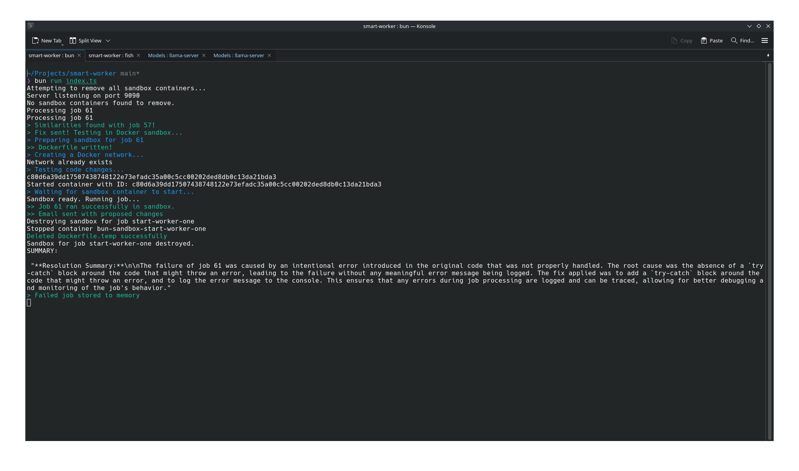
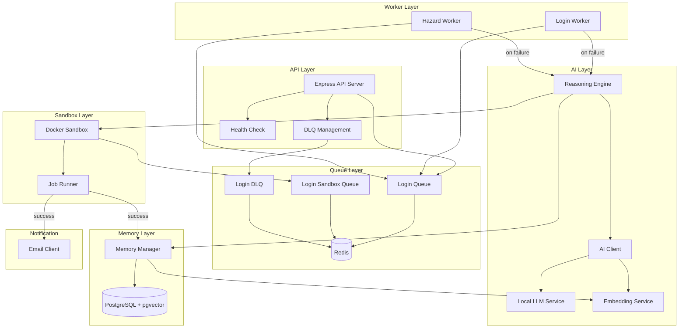
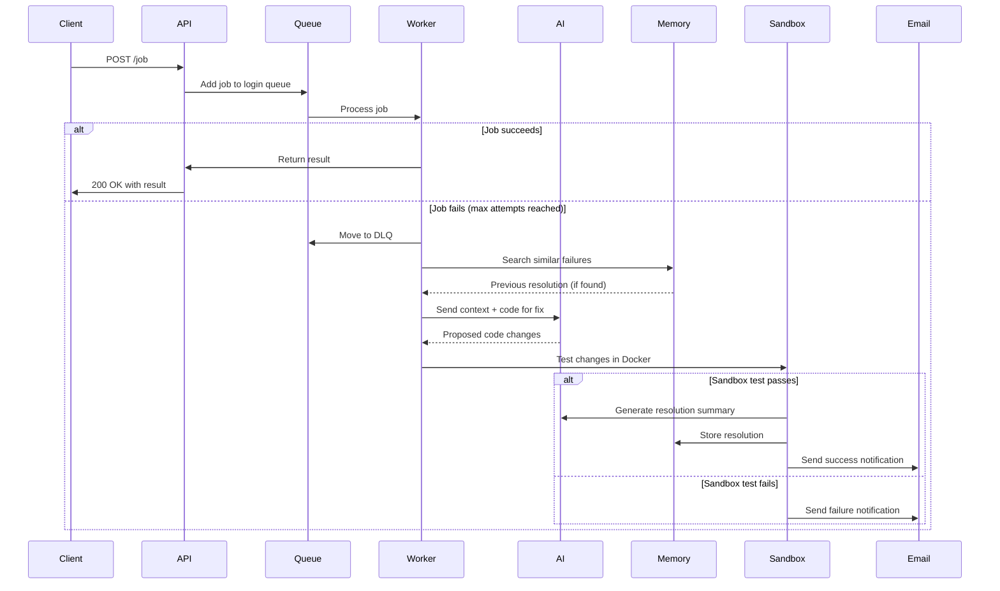
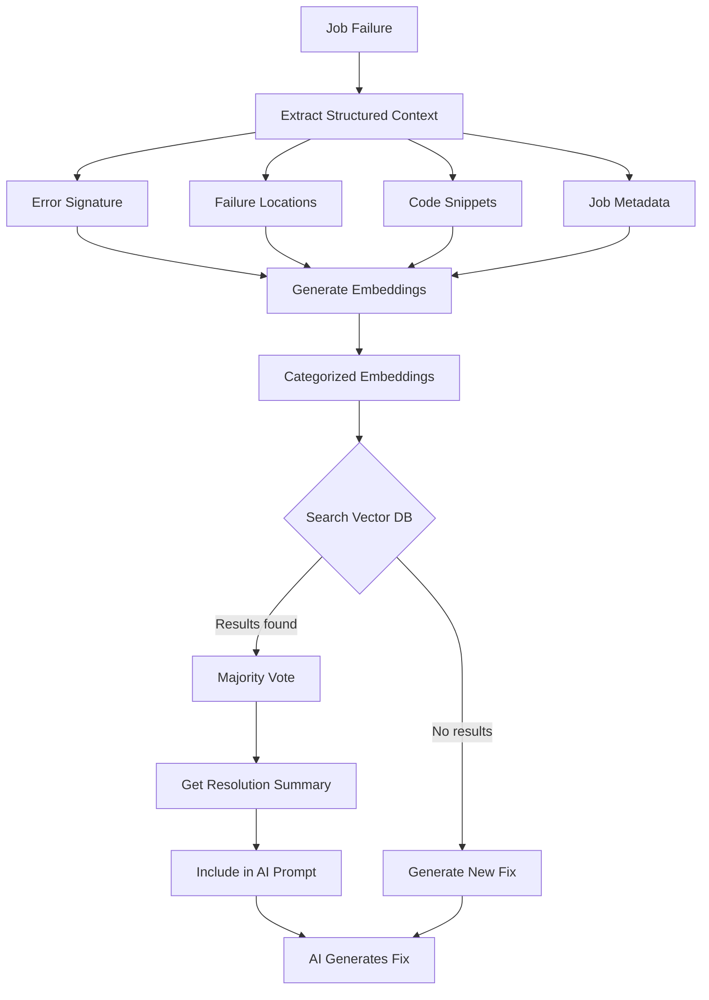

# SmartWorker - Job Processing System with AI-Powered Error Resolution



This project is a robust job processing system built with Bun, TypeScript, and BullMQ. It features an innovative AI layer that automatically attempts to fix failing jobs by leveraging a Large Language Model (LLM) and running the proposed fixes in a secure Docker sandbox. It also includes a Memory Layer for long-term storage and retrieval of failure contexts using vector embeddings.

## Architecture

### System Overview



### Job Processing Flow



### Memory Search Flow



## Features

- **Job Queuing:** Utilizes BullMQ and Redis to manage and process jobs asynchronously.
- **AI-Powered Error Resolution:** When a job repeatedly fails, it's passed to an AI layer. The AI analyzes the stack trace and relevant code, generates a fix, and tests it in a sandboxed environment.
- **Docker Sandbox:** Proposed fixes are tested in an isolated Docker container to ensure they are effective and don't introduce new issues.
- **Memory Layer:** Stores failed job metadata, stack traces, and code context in a PostgreSQL database with `pgvector` embeddings for future analysis and retrieval.
- **Categorized Embeddings:** Failure context is split into weighted categories (error signature, failure location, code context, metadata) for more accurate similarity matching.
- **Structured Failure Context:** Automatically extracts error signatures, parses stack trace locations, and generates focused code snippets around failure points.
- **Similarity Search with Majority Voting:** When a job fails, the system searches for similar past failures using weighted embeddings and elects the best match via majority vote.
- **Email Notifications:** If a fix is successful (or fails), an email is sent with the results and code changes, allowing for review and manual application.
- **Dead Letter Queue (DLQ):** Failed jobs are moved to a DLQ for manual inspection or reprocessing.
- **DLQ Management API:** Full REST API for managing the dead letter queue (list, retry, delete).
- **Health Checks:** Built-in health endpoint for monitoring Redis and PostgreSQL connectivity.
- **Graceful Shutdown:** Proper signal handling for clean application shutdown.
- **Structured Logging:** JSON logging with Pino for production environments.
- **Centralized Configuration:** Zod-validated environment configuration with fail-fast behavior.
- **Docker Support:** Dockerfile and docker-compose for containerized deployment.
- **Swagger UI:** Interactive API documentation at `/docs`.

## How It Works

1.  **Job Creation:** Jobs are added to the `loginQueue` via the `/job` API endpoint or the root `/` endpoint.
2.  **Job Processing:** A `loginWorker` processes jobs from the queue.
3.  **Failure Detection:** If a job fails multiple times (as defined by the job's `attempts` option), the `failed` event listener on the worker moves the job to the `loginDLQ` (Dead Letter Queue).
4.  **AI Intervention:** If the `reasoning_fix` flag is set on the job data, the `jobFailureReasoning` function is triggered.
5.  **Structured Context Extraction:** The system extracts structured failure context including:
    - **Error Signature:** Normalized error type and message (with dynamic values like IDs/timestamps replaced)
    - **Failure Locations:** Parsed stack trace with file paths, line numbers, and function names
    - **Focused Code Snippets:** Code surrounding each failure location with line markers
6.  **Memory Search:** Before generating a fix, the system searches for similar past failures using categorized embeddings with weighted distances. A majority vote algorithm selects the best matching previous job.
7.  **LLM Interaction:** The code, error information, and any relevant past resolution summaries are sent to an LLM with a prompt asking it to fix the code.
8.  **Sandbox Testing:** The LLM's proposed code changes are applied in a temporary Docker container (a "sandbox"). The failed job is then re-run within this sandbox using the `login-sandbox` queue.
9.  **Success Notification:** If the job succeeds in the sandbox, an email is sent with the proposed code changes.
10. **Resolution Summary:** On successful fix, an LLM generates a concise resolution summary explaining the root cause and applied fix.
11. **Memory Storage:** Resolved failures are stored in the Memory Layer with categorized embeddings (error signature, failure location, code context, metadata) weighted by importance for future similarity matching.
12. **Sandbox Destruction:** The Docker sandbox container is destroyed after the test run.

## Project Structure

```
.
├── config.ts               # Centralized Zod-validated configuration
├── logger.ts               # Pino-based structured logging
├── types/
│   └── index.ts            # Shared TypeScript type definitions
├── services/
│   └── ai-client.ts        # AI provider abstraction
├── workers/
│   ├── index.ts            # Worker initialization and exports
│   ├── login-worker.ts     # Production worker
│   └── hazard-worker.ts    # Test/hazard scenarios worker
├── memory-layer/
│   └── memory.ts           # Categorized embedding generation and search
├── reasoning-layer/
│   ├── destroy-sandbox.ts  # Docker container cleanup
│   ├── entrypoint.ts       # Docker sandbox entrypoint
│   ├── reasoning.ts        # Context extraction and LLM interaction
│   ├── run-job.ts          # Sandbox job execution
│   └── sandbox.ts          # Docker sandbox management
├── docs/
│   └── openapi.yaml        # OpenAPI 3.0 specification
├── tests/
│   ├── utils.test.ts       # Utility function tests
│   ├── config.test.ts      # Configuration validation tests
│   ├── reasoning.test.ts   # Context extraction tests
│   ├── api.test.ts         # API endpoint tests
│   └── worker.test.ts      # Worker logic tests
├── email.ts                # Email notifications
├── index.ts                # Express server, API routes, graceful shutdown
├── queues.ts               # BullMQ queue definitions
├── redis.ts                # Redis connection management
├── sql.ts                  # PostgreSQL/pgvector operations
├── utils.ts                # Utility functions
├── Dockerfile              # Application container
├── docker-compose.yml      # Full stack orchestration
└── init.sql                # PostgreSQL initialization
```

## Key Technologies

- **Runtime:** [Bun](https://bun.sh/)
- **Language:** [TypeScript](https://www.typescriptlang.org/)
- **Framework:** [Express.js](https://expressjs.com/)
- **Job Queue:** [BullMQ](https://bullmq.io/)
- **Database/Broker:** [Redis](https://redis.io/)
- **Persistent Storage:** [PostgreSQL](https://www.postgresql.org/) with [pgvector](https://github.com/pgvector/pgvector)
- **Containerization:** [Docker](https://www.docker.com/)
- **Email:** [Nodemailer](https://nodemailer.com/)
- **Logging:** [Pino](https://getpino.io/)
- **Validation:** [Zod](https://zod.dev/)
- **API Documentation:** [Swagger UI](https://swagger.io/tools/swagger-ui/)
- **AI/LLM:**
  - **Code Generation:** `qwen2.5-coder-3b-instruct` (via OpenAI-compatible API on port 8100)
  - **Embeddings:** `bge-large-en-v1.5` (1024 dimensions, via API on port 8110)

## Getting Started

### Prerequisites

- [Bun](https://bun.sh/docs/installation)
- [Docker](https://docs.docker.com/get-docker/)
- A running Redis instance
- A running PostgreSQL instance with the `pgvector` extension enabled
- Local LLM and Embedding services running (as specified in Key Technologies)

### Installation

1.  Clone the repository:
    ```bash
    git clone <repository-url>
    cd smart-worker
    ```
2.  Install dependencies:
    ```bash
    bun install
    ```

### Configuration

Create a `.env` file in the root of the project with the following environment variables:

```env
# Application
APP_PORT=9090
APP_ROOT_DIR=/path/to/smart-worker
EXECUTION_CONTEXT=host
NODE_ENV=development

# Redis
APP_REDIS_HOST=localhost
APP_REDIS_PORT=6379

# Database (required)
APP_DB_HOST=localhost
APP_DB_PORT=5432
APP_DB_USER=your_db_user
APP_DB_PASSWORD=your_db_password
APP_DB_NAME=smartworker

# AI Services
AI_SERVICE_URL=http://localhost:8100
AI_MODEL_NAME=qwen2.5-coder-3b-instruct-q4_k_m.gguf
AI_EMBEDDING_URL=http://localhost:8110
AI_EMBEDDING_MODEL=bge-large-en-v1.5-f32

# SMTP (optional - emails disabled if not set)
APP_SMTP_HOST=your_smtp_host
APP_SMTP_PORT=your_smtp_port
APP_SMTP_USER=your_smtp_user
APP_SMTP_PASS=your_smtp_password
APP_SMTP_TO_USER=recipient_email
```

### Running the Application

#### Local Development

```bash
bun run index.ts
```

#### Using Docker Compose

```bash
docker-compose up -d
```

This will start:
- SmartWorker application
- Redis
- PostgreSQL with pgvector

### Running Tests

```bash
bun test
```

### API Endpoints

| Method | Endpoint | Description |
|--------|----------|-------------|
| GET | `/` | Create a test job (triggers AI resolution) |
| POST | `/job` | Create a custom job |
| GET | `/health` | System health check |
| GET | `/dlq` | List jobs in DLQ (paginated) |
| POST | `/dlq/:jobId/retry` | Retry a job from DLQ |
| DELETE | `/dlq` | Clear all DLQ jobs |
| DELETE | `/dlq/:jobId` | Remove specific job from DLQ |
| GET | `/docs` | Swagger UI documentation |

### Example Usage

1.  Start the application:
    ```bash
    bun run index.ts
    ```

2.  Create a test job that will trigger AI resolution:
    ```bash
    curl http://localhost:9090
    ```

3.  Create a custom job:
    ```bash
    curl -X POST http://localhost:9090/job \
         -H "Content-Type: application/json" \
         -d '{
               "name": "my-custom-job",
               "data": { "key": "value" }
             }'
    ```

4.  Check system health:
    ```bash
    curl http://localhost:9090/health
    ```

5.  View DLQ:
    ```bash
    curl http://localhost:9090/dlq
    ```

6.  Retry a failed job:
    ```bash
    curl -X POST http://localhost:9090/dlq/123/retry
    ```

## Environment Variables Reference

| Variable | Required | Default | Description |
|----------|----------|---------|-------------|
| `APP_DB_HOST` | Yes | - | PostgreSQL host |
| `APP_DB_PORT` | Yes | - | PostgreSQL port |
| `APP_DB_USER` | Yes | - | PostgreSQL user |
| `APP_DB_PASSWORD` | Yes | - | PostgreSQL password |
| `APP_DB_NAME` | Yes | - | PostgreSQL database name |
| `APP_REDIS_HOST` | No | localhost | Redis host |
| `APP_REDIS_PORT` | No | 6379 | Redis port |
| `APP_PORT` | No | 9090 | Application port |
| `APP_ROOT_DIR` | No | - | Root directory for code resolution |
| `EXECUTION_CONTEXT` | No | host | Execution context (host/sandbox) |
| `NODE_ENV` | No | development | Environment mode |
| `AI_SERVICE_URL` | No | http://localhost:8100 | LLM service URL |
| `AI_MODEL_NAME` | No | qwen2.5-coder-3b-instruct-q4_k_m.gguf | LLM model name |
| `AI_EMBEDDING_URL` | No | http://localhost:8110 | Embedding service URL |
| `AI_EMBEDDING_MODEL` | No | bge-large-en-v1.5-f32 | Embedding model name |
| `APP_SMTP_HOST` | No | - | SMTP server host |
| `APP_SMTP_PORT` | No | - | SMTP server port |
| `APP_SMTP_USER` | No | - | SMTP username |
| `APP_SMTP_PASS` | No | - | SMTP password |
| `APP_SMTP_TO_USER` | No | - | Email recipient |
| `HAZARD_TESTING` | No | false | Enable hazard worker for testing |

## License

MIT
